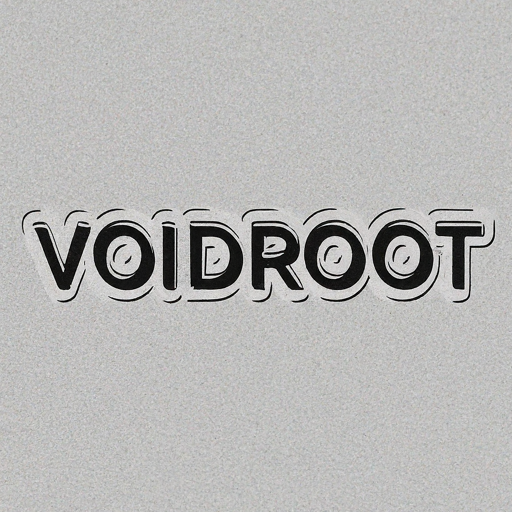

# Hi, I'm Swayam 👋

I'm a computer science student fascinated by data science, graphic design, and the possibilities of virtual reality.  

* 🔭 Currently exploring Python, data analysis tools, and game development frameworks.
* 🌱 Learning more about VR for both the entertainment and research applications.
* ⚡ Winner of 2nd place in DataVerse event at St. Vincent Pallotti College of Engineering & Technology. 
* 🤔 Open to collaborations, learning opportunities, and building fun projects!

**Reach me at:**
[takkamoreswayam@gmail.com](mailto:takkamoreswayam@gmail.com)
[LinkedIn](https://www.linkedin.com/in/swayam-voidroot)

<!--
**SwayamTakkamore/SwayamTakkamore** is a ✨ _special_ ✨ repository because its `README.md` (this file) appears on your GitHub profile.

Here are some ideas to get you started:

- 🔭 I’m currently working on ...
- 🌱 I’m currently learning ...
- 👯 I’m looking to collaborate on ...
- 🤔 I’m looking for help with ...
- 💬 Ask me about ...
- 📫 How to reach me: ...
- 😄 Pronouns: ...
- ⚡ Fun fact: ...
-->
